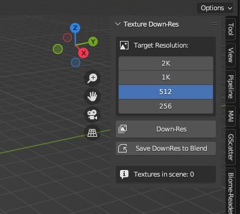

# Blender Down-Res

A tool to lower the resolution on all textures in a scene with one click.

Quick look at the Blender Down-Res interface:

Watch our tutorials on youtube: https://www.youtube.com/@DeadDogDown.GameStudio

## 🖥️ Compatibility

✅ **Currently supports:**

- [Blender 5.0 LTS](https://www.blender.org/download/releases/5-0/)  
- [Blender 4.5 LTS+](https://www.blender.org/download/releases/4-5/)
- [Blender 3.6 LTS+](https://www.blender.org/download/releases/3-6/)

This add-on is designed to work with **Blender LTS (Long Term Support)** versions, ensuring stability and long-term usability for production pipelines.
It WILL probably work on your version of Blender that is a non-LTS, so give it a try.

- https://github.com/deaddogdown/BlenderDownRes
- https://projects.blender.org/deaddogdown/BlenderDownRes
- https://www.youtube.com/@DeadDogDown.GameStudio

## 🎯 What It Does

Down-Res is a production tool that saves time on tedious texture management tasks. It allows you to:

- Reduce texture resolutions across your entire scene with one click
- Down-scaled textures ready for export
- Only save to blend permanently when you're ready
- Maintain aspect ratios automatically

## 🧰 Features

- **Non-destructive workflow** - Preview changes before saving
- **Four resolution presets** - 2K, 1K, 512, 256 pixels
- **One-click Down Res** - See immediate results in your viewport and export ready
- **Save to blend file** - Make changes permanent when you're happy
- **Automatic aspect ratio** - Maintains correct proportions
- **Texture counting** - See how many textures are in your scene
- **Largest texture detection** - Know your biggest file at a glance
- **Compatible with Blender LTS versions** - Production ready
- **100% free and open source** - Forever

## Why Down-Res?

Game developers, 3D artists, and content creators often need to:

- Optimize assets for game engines
- Reduce memory usage in large scenes
- Create lower-resolution variants of textures
- Prepare assets for mobile or web deployment

Down-Res makes this process fast, visual, and safe.

## Message from a Game Developer

"I used to spend hours manually scaling textures one by one. Down-Res does it in seconds, and the preview feature means I never accidentally destroy my original textures. It's a production lifesaver."

## 📦 Installation

### Step-by-step:

1. Open **Blender**
2. Go to:  
   `Edit → Preferences → Add-ons`
3. Click:  
   `Install...`
4. Select the downloaded `.zip` file
5. Enable the add-on in the list

The panel will appear in the 3D Viewport N-Panel under the "Down-Res" tab.

## 🚀 How To Use

1. Select your target resolution (2K, 1K, 512, or 256)
2. Click **"Preview Down-Res"** - See the results instantly
3. Happy with the result? Click **"Save DownRes to Blend"** - Makes it permanent
4. Not happy? Just close Blender without saving - Original textures remain intact

That's it. No complex settings. No hidden menus.

## 💬 Welcome Message from the Developer

Welcome to Blender Down-Res.

This tool was designed for production environments where time is money. Texture optimization shouldn't be a tedious chore. It should be one click, a quick visual check, and done.

Blender Down-Res is free for life. If you'd like to support us so we can keep this addon up-to-date for future Blender LTS versions, please feel free to donate, sponsor, or help fund this addon.

We focus on LTS versions because production pipelines need stability. We don't chase alpha, beta, or RC releases that break workflows.

Enjoy optimizing your scenes!

## ❤️ Support Development

This project is free to use and always will be. However, maintaining compatibility with future Blender LTS versions requires time and effort.

If you find this useful and would like to support continued development:

📧 Contact: [deaddogdown.gamestudio@gmail.com](mailto:deaddogdown.gamestudio@gmail.com)  
💸 Funders welcome via email — any amount helps!

## 📜 License

This addon is licensed under the **GNU General Public License v2.0** — same as Blender itself.

You are free to:
- ✅ Use it
- ✅ Share it

With the condition that:
- 🔁 Any derivative work must also remain open source and free of charge, with no login, registration, or conditions for access, and must remain under the same license and give credit to "Dead Dog Down Game Studio" with a link back to github.com/deaddogdown

We do not push updates during production. That's production suicide. We do not collect metrics, use your data, or violate your trust. We respect your privacy and that you want to be left alone to do what you do best.

We believe that our reward must come from real work as we bring our games to you when the time is right.

See the [LICENSE](LICENSE) file for full terms.

## 🧑‍💻 Developed by

**DEAD DOG DOWN - GAME STUDIO**

We make tools and games — and help creators optimize their workflow through open-source software.

## ™ Disclaimer

"Blender" is a registered trademark of the Blender Foundation.  
This project is **not affiliated with**, endorsed by, or supported by the Blender Foundation or any of its subsidiaries.

The use of the term "Blender" in this project's name and description is for descriptive purposes only, to indicate compatibility with Blender software.

---

## Legal

All rights reserved. This addon is for public benefit and follows Blender.org license policy of GPLv2 for all perpetuity. No permission is given to publish this addon on any third party store, whether free or paid, without the consent of the creator. If you paid for this addon, were forced to sign up for something, or had to install software to get it, make sure to ask for your money back, delete that account and go GPLv2.
